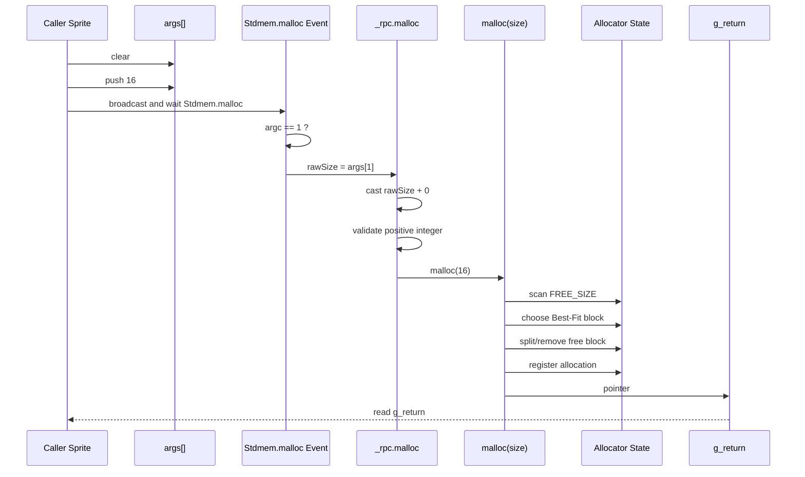
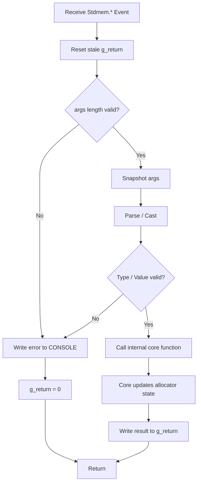
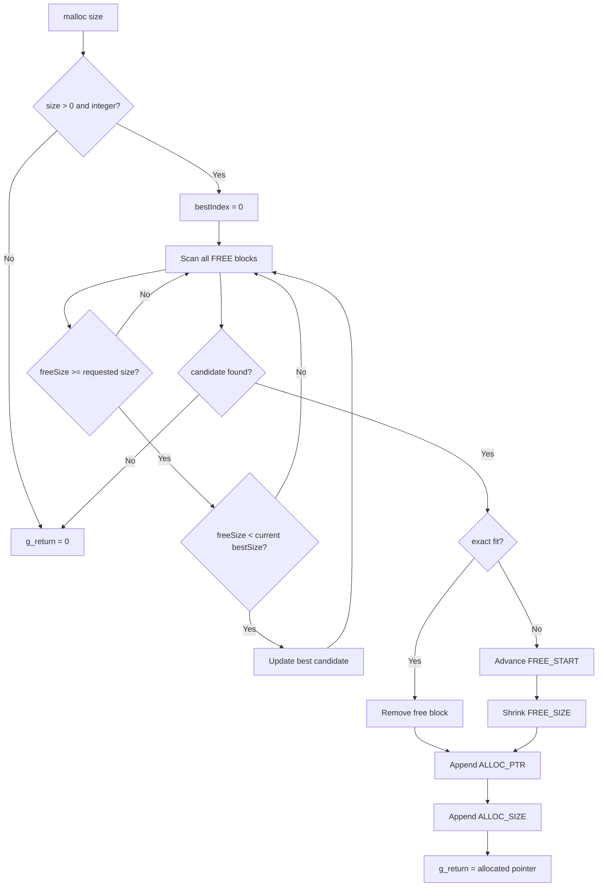
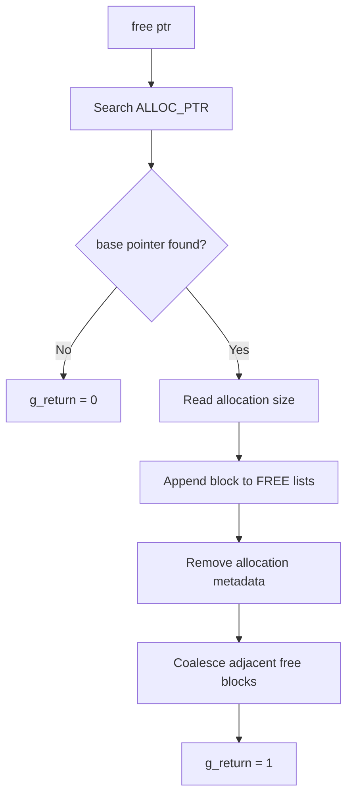
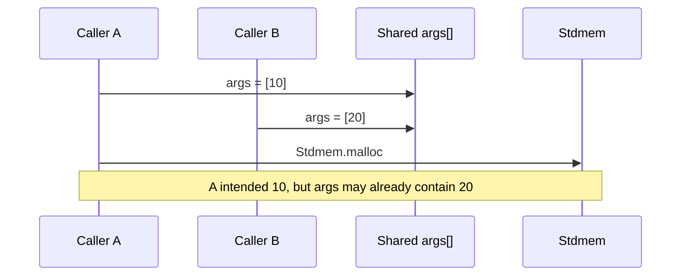

# Stdmem Design

`Stdmem` は Scratch の List を仮想ヒープとして扱い、C の `malloc` / `free` に近いメモリ管理と、別スプライトから利用するためのイベント RPC インターフェースを提供するライブラリです。

このページでは、公開 API、引数・戻り値・型、呼出規約、内部構造、Best-Fit allocator の設計を整理します。

---

## 1. 目的

Scratch には以下の制約があります。

- カスタムブロックは別スプライトから直接呼べない
- Broadcast には引数を渡せない
- カスタムブロックに通常の戻り値がない
- ポインタやヒープメモリが存在しない

`Stdmem` はこれらを補うため、次の抽象を導入します。

```text
List          -> Heap
List index    -> Pointer
args          -> Variadic argument register
Broadcast     -> External function call
 g_return     -> Return register
Stdmem sprite -> Memory service
```

---

## 2. Public API

公開インターフェースは Broadcast イベントです。

命名規則:

```text
<UpperCamelCase Sprite>.<camelCase function>
```

現在の API:

| Event | 意味 |
|---|---|
| `Stdmem.init` | ヒープを初期化する |
| `Stdmem.malloc` | Best-Fit で連続領域を確保する |
| `Stdmem.free` | 確保済み領域を解放する |
| `Stdmem.read` | 1セル読み出す |
| `Stdmem.write` | 1セル書き込む |
| `Stdmem.dump` | allocator 状態を `CONSOLE` に出力する |

---

## 3. ABI

### 3.1 `args`

Broadcast には引数機構がないため、プロジェクトグローバル List `args` を可変長引数領域として利用します。

```text
args[1] = arg0
args[2] = arg1
args[3] = arg2
...
```

呼び出し側は、イベント送信前に `args` を構築します。

```text
args をすべて削除
args に 16 を追加
Stdmem.malloc を送って待つ
```

### 3.2 `g_return`

戻り値が必要な API は、プロジェクトグローバル変数 `g_return` へ結果を書き込みます。

```text
Stdmem.malloc を送って待つ
ptr = g_return
```

`g_return` は共有レジスタなので、戻り値を利用する側はなるべく直後に caller-owned variable へ退避してください。

### 3.3 非同期性

通常の Broadcast は非同期です。

したがって、次の呼び出しは安全ではありません。

```text
Stdmem.malloc を送る
ptr = g_return
```

`Stdmem` 側がまだ処理を終えていない可能性があります。

戻り値や完了を待つ必要がある場合は、原則として以下を利用します。

```text
Stdmem.malloc を送って待つ
```

現在の ABI は `args` / `g_return` を共有するため、**single-flight** を前提とします。同時呼び出しは未サポートです。

---

## 4. 型モデル

Scratch 自体は静的型システムを持ちません。そのため `Stdmem` ではイベント境界で型を検査し、内部関数へ渡す前に正規化します。

概念上の型を以下のように定義します。

```text
type Pointer = PositiveInteger | 0

type Size = PositiveInteger

type HeapValue = ScratchValue

type Result<T> = T | 0
```

`ScratchValue` は Scratch が List に保持できる値を意味します。

### Pointer

```text
0      = NULL / failure
1..N   = HEAP の有効なアドレス
```

Scratch List は 1-origin のため、ポインタ値をそのまま List index として扱います。

### Size

`malloc` / `init` のサイズは正の整数です。

```text
size > 0
floor(size) = size
```

### HeapValue

`Stdmem.write` の value は数値へ強制キャストしません。

```text
number
string
boolean-like value
...
```

をそのまま仮想ヒープへ保持できます。

---

## 5. API specification

### 5.1 `Stdmem.init`

#### Args

```text
args[1]: Size
```

#### Return

```text
g_return: 1 | 0
```

- `1`: success
- `0`: invalid argument

#### Effect

- `HEAP` を初期化
- free/allocated metadata を初期化
- 1個の free block を生成
- `CONSOLE` を初期化

---

### 5.2 `Stdmem.malloc`

#### Args

```text
args[1]: Size
```

#### Return

```text
g_return: Pointer
```

- `1..N`: allocation base pointer
- `0`: invalid argument / out of memory

#### Allocation policy

Best-Fit を採用します。

要求サイズ以上の free block のうち、最小の block を選択します。

---

### 5.3 `Stdmem.free`

#### Args

```text
args[1]: Pointer
```

#### Return

```text
g_return: 1 | 0
```

- `1`: success
- `0`: pointer が active allocation の base pointer ではない

`free` には `malloc` が返した base pointer をそのまま渡す必要があります。

`base + offset` のような interior pointer は解放できません。

---

### 5.4 `Stdmem.read`

#### Args

```text
args[1]: Pointer
```

#### Return

```text
g_return: HeapValue | 0
```

現状はヒープ範囲のみを確認します。

そのセルが現在 active allocation に属しているかどうかは確認しません。

---

### 5.5 `Stdmem.write`

#### Args

```text
args[1]: Pointer
args[2]: HeapValue
```

#### Return

```text
g_return: 1 | 0
```

`ptr` は正整数へ cast / validate します。

`value` は型変換せず、そのまま格納します。

---

### 5.6 `Stdmem.dump`

#### Args

```text
args = []
```

#### Return

```text
g_return: 1
```

allocator の allocation/free 状態を `CONSOLE` List へ書き込みます。

---

## 6. RPC sequence

`Stdmem.malloc(16)` を外部スプライトから呼ぶ場合のシーケンスです。



ポイントは、イベント受信部が allocator 本体ではなく **Interface Adapter** であることです。

---

## 7. RPC flow

イベント受信後の処理フローです。



この分離により、イベント、引数配列、キャストといった Scratch 特有の制約を allocator core から隔離します。

---

## 8. malloc Best-Fit flow



---

## 9. free / coalesce flow



coalesce は隣接する free region がなくなるまで反復します。

---

## 10. Memory layout

### Flat array

```text
ptr = malloc(4)

ptr + 0 -> item 0
ptr + 1 -> item 1
ptr + 2 -> item 2
ptr + 3 -> item 3
```

論理 offset は 0-origin とします。

ポインタそのものが Scratch List の最初の有効 index を持つため、`base + offset` でアクセスできます。

### Record

例えば Vertex を3セルで表現する場合:

```text
base + 0 -> x
base + 1 -> y
base + 2 -> z
```

```text
Vertex* v = malloc(3)
```

に近い扱いができます。

---

## 11. Internal state

`Stdmem` スプライトに閉じる内部状態:

```text
HEAP
FREE_START
FREE_SIZE
ALLOC_PTR
ALLOC_SIZE
CONSOLE

malloc.heapSize
malloc.i
malloc.j
malloc.bestIndex
malloc.bestSize
malloc.start
malloc.curSize
malloc.otherStart
malloc.otherSize
malloc.allocIndex
malloc.merged
```

外部スプライトはこれらへ直接依存しないことを推奨します。

---

## 12. Error handling

Scratch には一般的な例外機構がないため、現状は次の規約を利用します。

```text
g_return = 0
CONSOLE に診断ログ
```

例:

```text
[rpc] Stdmem.malloc: argc=2 expected=1
[rpc] Stdmem.write: invalid ptr=abc
[malloc] OOM size=1000
```

将来的には `status` や Result-like な表現を別途導入する余地があります。

---

## 13. Comment blocks

コード中の説明用に、処理を何もしない custom block を用意します。

```text
/* (comment) */
// (comment)
```

用途:

```text
/* Best-Fit 方式で空き領域を検索する */

// 要求サイズ以上で最小の free block を保持する
```

Scratch の workspace comment とは別に、処理フローの中へコメントを置けることを意図しています。

---

## 14. Concurrency model

現在の ABI は以下を共有します。

```text
args
g_return
```

そのため再入可能ではありません。



現行版では **1つの呼び出しが完了するまで次の呼び出しを開始しない**ことを前提とします。

並行呼び出しが必要になった場合は、以下のような Request Object / Queue を検討します。

```text
requestId
method
args
status
result
```

---

## 15. Design principles

`Stdmem` では次の境界を重視します。

```text
External transport
    Broadcast / args
          ↓
Interface Adapter
    Parse / Cast / Validation
          ↓
Allocator Core
    malloc / free / read / write
          ↓
State
    HEAP / metadata
```

目的は、Scratch の制約を隠すことではなく、**制約が影響する範囲を境界へ集約すること**です。

これにより allocator core は通常の手続き型関数に近い形で保ち、外部通信方式が変化してもコアロジックへの影響を抑えます。

---

## 16. Known limitations

- `realloc` 未実装
- alignment 未実装
- allocator header 未実装
- `mem_read` / `mem_write` は allocation ownership を検査しない
- use-after-free を検出しない
- `args` / `g_return` は single-flight
- `g_return = 0` は API によって valid zero value と曖昧になる場合がある

必要になった時点で、上位互換を意識しながら拡張します。
